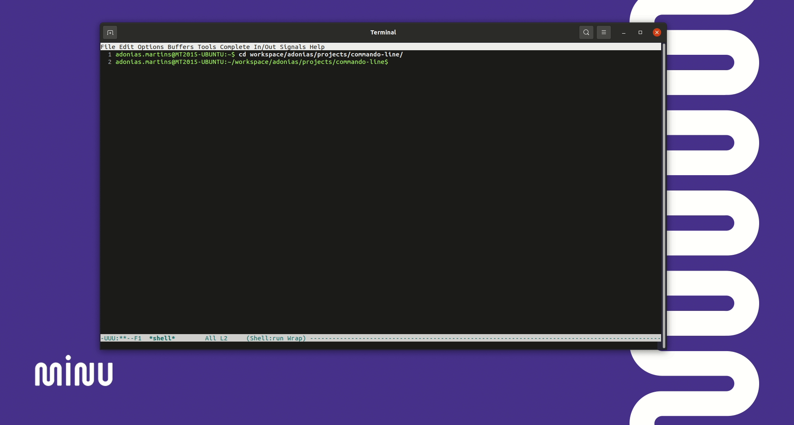

# Q&A CLI



Q&A - Um lançador de Perguntas e Respostas Interativas para linha de comando! 
Este projeto oferece uma experiência interativa onde os usuários podem responder a uma série de perguntas a partir de um arquivo `.json` e receber resultados personalizados. É uma aplicação versátil que pode ser adaptada para diversas finalidades, como pesquisas, questionários ou jogos.

## Como Usar

### Clonando o Projeto

Você pode clonar este projeto para o seu computador usando o seguinte comando Git:

```bash
git clone https://github.com/adoniasvitorio/qa-command-line.git
```

### Executando o Projeto
```bash
cd qa-command-line
```
```bash
node index.js
```

## Descrição das Propriedades do Arquivo JSON

| Propriedade     | Descrição                                       |
| --------------- | ----------------------------------------------- |
| `greetings`     | Saudação de boas-vindas exibida antes das perguntas. |
| `prompts`       | Uma matriz de objetos representando as perguntas interativas. Cada objeto contém as seguintes propriedades: |
| `prompts.name`          | Identificador para pergunta. |
| `prompts.question`      | A pergunta que será exibida ao usuário.         |
| `prompts.key`      | Usado como chave para armazenar a resposta..         |
| `options`       | Uma matriz de opções de resposta, cada uma contendo as seguintes propriedades: |
| `options.name`          | Nome da opção de resposta.                      |
| `options.answer`        | A resposta correspondente à opção selecionada.  |

Certifique-se de atualizar as descrições de acordo com as informações reais do seu arquivo JSON. Isso fornecerá uma documentação clara das propriedades e de como elas são usadas no seu projeto.

### Funcionalidades Principais

- **Perguntas Personalizadas:** Adicione facilmente perguntas e opções de resposta ao arquivo JSON, tornando a personalização simples e rápida.

- **Saudações de Boas-Vindas:** Cumprimente os usuários com uma mensagem amigável antes de começarem a responder às perguntas.

- **Interação Passo a Passo:** As perguntas são apresentadas uma de cada vez, permitindo que os usuários respondam com calma e precisão.

- **Armazenamento de Respostas:** Todas as respostas dos usuários são armazenadas e podem ser exibidas no final da interação.

### Dependências do Projeto

[readline](https://nodejs.org/api/readline.html): Um módulo Node.js que facilita a leitura de entrada do usuário na linha de comando.
Você pode encontrar uma lista completa de dependências no arquivo package.json do projeto.

### Contribuição

Contribuições são bem-vindas! Se você deseja melhorar este projeto, sinta-se à vontade para criar um fork e enviar um pull request.

## Licença

Este projeto está licenciado sob a Licença [MIT](LICENSE).